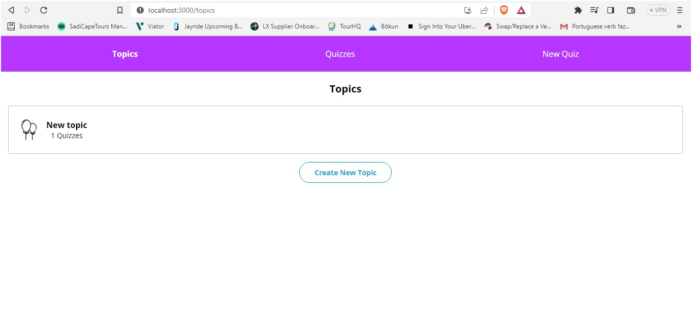
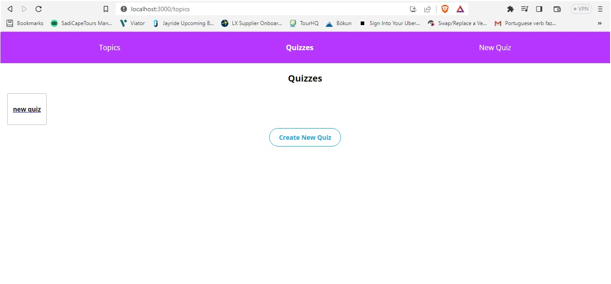
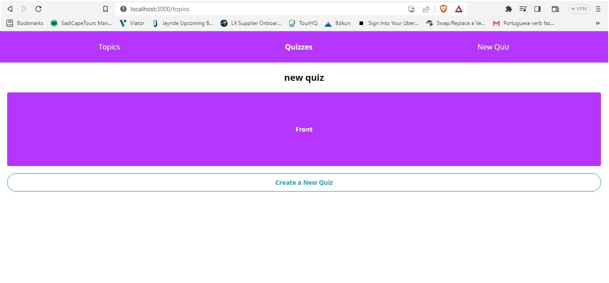

# Codecademy Challenge Project - Flashcards

Instead of a step-by-step tutorial, this project contains a series of open-ended requirements which describe this project. There are many possible ways to correctly fulfill all of these requirements, and I used github, Codecademy (Forum), when I encountered a problem that I could not easily solve.

In this project, I practice using Redux and Redux Toolkit to manage the complex state of a flashcard-style quiz app. Users will be able to create their own topics, quizzes for those topics, and flashcards for those quizzes. Users will also be able to interact with their quizzes by flipping flashcards over.

## Table of Contents

- [Licence](#licence)
- [General Info](#general-information)
- [Technologies Used](#technologies-used)
- [Screenshots](#screenshots)
- [Setup](#setup)
- [Project Status](#project-status)
- [Acknowledgements](#acknowledgements)
- [Contact](#contact)

<!-- * [License](#license) -->

## Licence

This project is open source. Personal logos and images should not be used without authorization.

## General Information

- To complete this project, I had to complete Codecademy’s Learn React and Learn Redux courses.
- Project Objectives:
  - Users can create topics
  - Users can view all topics
  - Users can click on an individual topic and be redirected to the page for that topic
  - Users can view an individual topic and all quizzes for that topic
  - Users can click on a quiz associated with a topic and be redirected to that quiz’s page
  - Users can create quizzes that are associated with topics and contain lists of flashcards
  - Users can add and remove card fields in the new quiz form
  - Users can view all quizzes
  - Users can click on an individual quiz and be redirected to that quiz’s page
  - Users can view an individual quiz and flip cards over
  <!-- You don't have to answer all the questions - just the ones relevant to your project. -->

## Technologies Used

- VSCode - version 1.60.2
- Google Chrome (browser)
- Git and GitHub

## Screenshots Part 1

## Screenshots Part 2

## Screenshots Part 3

## Setup

To navigate to the website use the following link:
[Flashcard web app](https://christsadi.github.io/flashcards-starter/)

You will find all the files and images which make up this website on this repository.

## Project Status

I will revisit and add more to this project as i progress in my course.

## Acknowledgements

- This project was based on <https://www.codecademy.com/journeys/front-end-engineer/paths/fecj-22-front-end-development/tracks/fecj-22-redux/modules/wdcp-22-flashcards-e915f31e-11e6-41d4-811a-744b084b474a/projects/react-redux-flashcards>.

- Many thanks to codecademy for this exposure.

## Contact

Created by [@Christ Sadi] - feel free to contact me!
